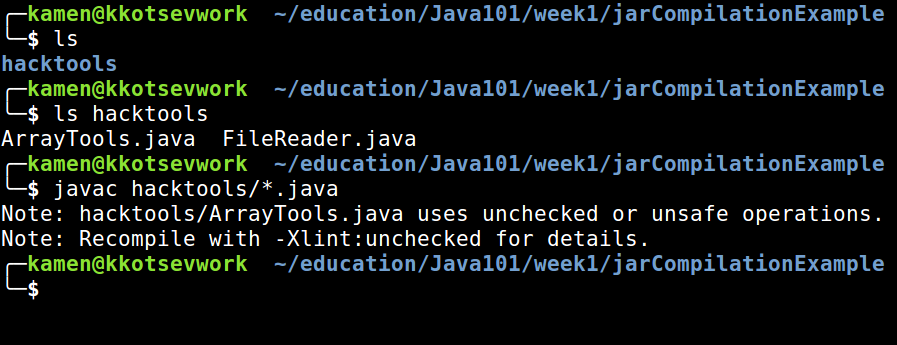
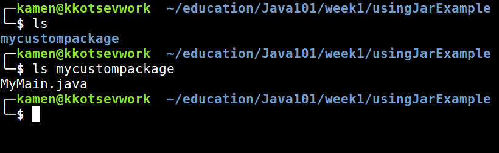
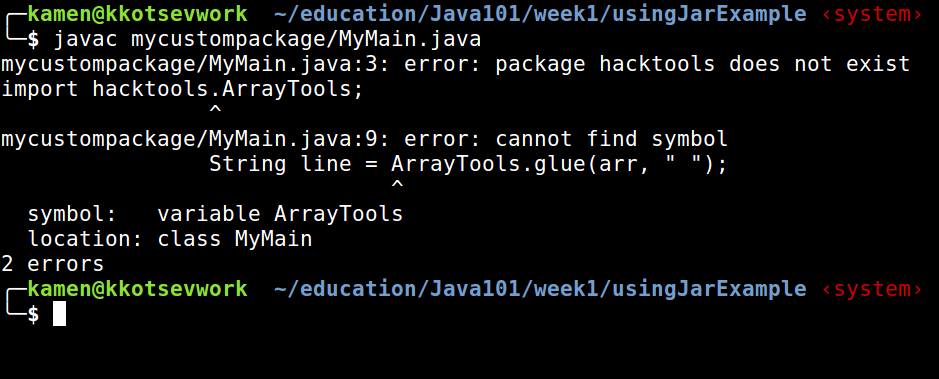

# Week1 Thirsday summary

On Thirsday we learned how to compile multiple files using `javac`
We also learned that our projects should have a certain file structure that we describe in our `packages`.

Lets get trough compiling a file one more time:

## Preparing the tools

When making a jar we should have several things first:

 * The `.java` files should first be compilled
 * The file structure should be the same as the packages structure

If we have a project named `jarCompilationExample` with the following file structure:

[]()

We can create the files that we want to include in our `.jar` file.

### FileReader

The idea for the `FileReader` is a class that has static methods for reading files and returning the contents as a data structure.

We can write such file in the following way:

```java
package hacktools;

import java.io.IOException;
import java.util.List;
import java.nio.file.Files;
import java.nio.file.Paths;

public class FileReader {
    public static String[] readToArray(String filename) {
        List<String> contents = readToList(filename);
        return contents.toArray(new String[contents.size()]);
    }

    public static List<String> readToList(String filename) {
        try {
        	return Files.readAllLines(Paths.get(filename));
        } catch(IOException e) {
        	e.printStackTrace();
            return null;
        }
    }
}
```

In this file we have methods that receive a filename and return the contents of the file in a `String[]` or a List of Strings.

**Note** that in the first line of the file we described the package of the file. The package name is the same as the directory(folder) that the file is in.

```java
package hacktools;
```

### ArrayTools

The idea for the `ArrayTools` is a class that has static methods for working with generic Arrays.

Here's an example for such a file:

```java
package hacktools;

import java.lang.Comparable;
import java.lang.Math;

public class ArrayTools {
	public static <T> String toString(T[] arr) {
		return "[" + glue(arr, ", ") + "]";
	}

	public static <T> String glue(T[] arr, String glue) {
		if(arr.length==0) return "";
		String result = "";
		for(int i=0; i < arr.length-1; i++) {
			result = result + arr[i] + glue;
		}
		return result + arr[arr.length-1];
	}

	public static <T> T[] reverse(T[] arr) {
		int len = arr.length;
		for(int i=0; i < len/2; i++) {
			T temp = arr[i];
			arr[i] = arr[len-i-1];
			arr[len-i-1] = temp;
		}
		return arr;
	}

	public static <T extends Comparable> T[] sort(T[] arr) {
		for(int i=0; i<arr.length; i++){
			for(int j=0; j<arr.length; j++){
				if(arr[i].compareTo(arr[j]) < 0){
					T temp = arr[i];
					arr[i] = arr[j];
					arr[j] = temp;
				}
			}
		}
		return arr;
	}

	public static void print(String s) {
		System.out.println(s);
	}

	public static Integer[] range(int from, int to) {
		int step = (from<to?1:-1);
		Integer[] arr = new Integer[Math.abs(from-to)];
		int index = 0;
		for(int i=from; i!=to; i+=step) {
			arr[index] = i;
			index++;
		}
		return arr;
	}
}
```

We can use the methods in this file to work with arrays of all referent types.
Do not be alarmed if you don't understand all the notations. This class is only for the example.

**Note** that in the first line of the file we described the package of the file. The package name is the same as the directory(folder) that the file is in.

---

After doing this we have the following structure for our project:

[]()

## Making the JAR

When making a JAR file we should first compile all our files.

### Compiling all the files

When compiling java files in packages be sure to always be in the directory before the first package so you can use the compile command easyer.

We can do this by using this simple command:

```
$ javac hacktools/*.java
```

This command will execute the compiler on all the `.java` files in the `hacktools` folder.

[]()

After this we get the `.class` files that correspond to the `.java` files that are in the `hacktools/` directory.

[]()

### Compiling the JAR

We can now compile the JAR using the following command:

```
jar cvf Hacktools.jar hacktools/*
```

 * First we provide the parameters for the JAR compilation. `cvf` are needed in order to create a file with the provided name and produce a verbouse output. You can read more about these commands by running `$ man jar`
 * `Hacktools.jar` is the name of the JAR
 * The second parameter are the files that we need to add to the JAR. `hacktools/*` means that we want to add all the files from the `hacktools/` folder

[]()

## Using the jar in another project

If we want to use a JAR in our project we should run the project using specific commands.
First we need a main method to run the JAR.

```java
package mycustompackage;

import hacktools.ArrayTools;

class MyMain{
	public static void main(String[] args) {
		String[] arr = {"This", "is", "an", "array"};

		String line = ArrayTools.glue(arr, " ");
		System.out.println(line);
	}
}
```

[]()

**Note** that the pakcage of the file is `mycustompackage` and we `import hacktools.ArrayTools`

If we try to compile this file using the standart command:

```
$ javac mycustompackage/MyMain.java
```

we will get the following error:

[]()

That is because we're trying to import a file that is not in the project. The file is in the JAR and in order to compile the file correctly - we should tell the compiler to add the JAR to the project.

First we need to download the JAR so we can refer the path to it when compiling.
After that we can compile the project.

We can do this with the following command:

```
$ javac -cp ../jarCompilationExample/Hacktools.jar mycustompackage/MyMain.java
```

[]()

When we provide `-cp` and a path to the JAR we add it to the classpath and it gets automatically added to the project.

Now we can run the project with this command:

```
$ java -cp ../jarCompilationExample/Hacktools.jar: mycustompackage.MyMain
```

[]()

**Note** the `:` after the path to the JAR
**Note** the directory we are in when compiling and running